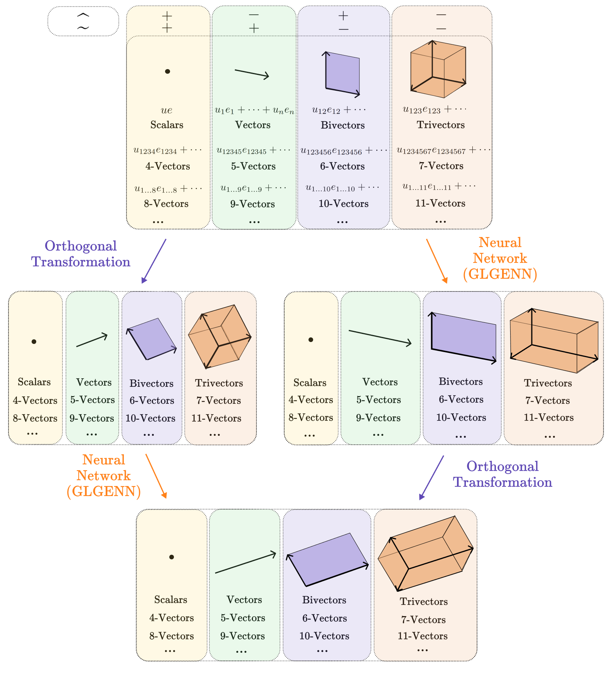

# GLGENN: A Novel Parameter-Light Equivariant Neural Networks Architecture Based on Clifford Geometric Algebras

## Abstract
We propose, implement, and compare with competitors a new architecture of equivariant neural networks based on geometric (Clifford) algebras: Generalized Lipschitz Group Equivariant Neural Networks (GLGENN). These networks are equivariant to all pseudo-orthogonal transformations, including rotations and reflections, of a vector space with any non-degenerate or degenerate symmetric bilinear form. We propose a weight-sharing parametrization technique that takes into account the fundamental structures and operations of geometric algebras. Due to this technique, GLGENN architecture is parameter-light and has less tendency to overfitting than baseline equivariant models. GLGENN outperforms or matches competitors on several benchmarking equivariant tasks, including estimation of an equivariant function and a convex hull experiment, while using significantly fewer optimizable parameters.

## Overview
This repository contains implementation of Generalized Lipschitz Group Equivariant Neural Networks (GLGENN). The architecture of GLGENN contains
* ${C \kern -0.1em \ell}^{\overline{k}}_{p,q,r}$-linear layers,
* ${C \kern -0.1em \ell}^{\overline{k}}_{p,q,r}$-geometric product layers,
* ${C \kern -0.1em \ell}^{\overline{k}}_{p,q,r}$-normalization layers,
* Conjugation Operations Layers.

The current implementation consider the case of the non-degenerate geometric algebras ${C \kern -0.1em \ell}_{p,q}$. Experiments in the degenerate case are planned.

## Code Organization
* `algebra/`: Contains implementation of quaternion types subspaces in Clifford algebra.
* `data/`: Contains data loading scripts for experiments.
* `engineer/`: Contains training, evaluation, and visualization scripts.
* `experiments/`: Contains experimental results.
* `layers/`: Contains architecture of GLGENN layers.
* `models/`: Contains models built from GLGENN layers.

## Experiments
GLGENN demonstrates enhanced performance on benchmark equivariant tasks, including equivariant regression task and convex hull volume estimation,  outperforming state-of-the-art models in several setups with fewer parameters, and demonstrating less tendency to overfitting. The setups and results of $\mathrm{O}(5,0)$-Equivariant Convex Hull Experiment, $\mathrm{O}(7,0)$-Equivariant Convex Hull Experiment, and $\mathrm{O}(5,0)$-Equivariant Regression Task Experiment are presented in `experiments/`.